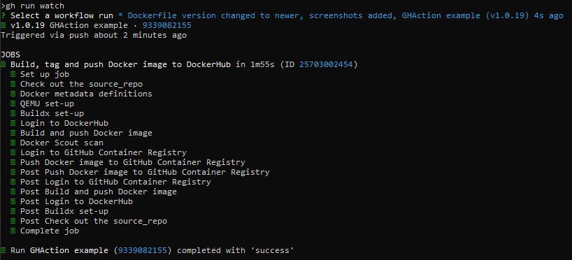

# docker-zadanie2
An example of extending the CI process with a CVE image test using Scout.

## Table of Contents

- [Requirements](#requirements)
- [CVE Test Configuration](#cve-test-configuration)
- [Starting CI Workflow](#starting-ci-workflow)

## Requirements

For Linux and Windows systems Docker or Docker Desktop must be installed and running.

For Windows systems WSL must be installed.

Create a repository on [hub.docker.com](https://hub.docker.com/) using your account.

Example for Windows:

Enroll your account for Scout:

```cmd
docker scout enroll eyelor
```

Enable your repository for Scout:

```cmd
docker scout repo enable --org eyelor eyelor/example
```

Result:


Logged into github:

```cmd
gh auth status
```

Result:


Init the git repository for project files:

```cmd
git init -b main
```

Result:


Create a repository on GitHub:

```cmd
gh repo create
```

Results:


## CVE Test Configuration

Default CI workflow in the yml file:


In order to provide proper input for the CVE test, the sha tag was deleted (it means that it is needed to push tags to repo instead of a workflow run):


Added docker/scout-action@v1 with command cves. It will scout the image built into this workflow for the selected platform. It will look only at critical and high severity, and if it finds any, it will exit. If so, then "if: success()" won't pass, and login and push image to ghcr.io actions won't be performed.


## Starting CI Workflow

Prepare a git repo commit:

```cmd
git add .
```

```cmd
git status
```

```cmd
git commit -m "docker-zadanie2 repo init"
```

Results:


Synchronize with the repository on Github:

```cmd
git push -u origin main
```

Result:


Add the necessary variables and secrets to the repository:

```cmd
gh secret set DOCKERHUB_TOKEN
```

```cmd
gh variable set DOCKERHUB_USERNAME
```

```cmd
gh secret set MY_GITHUB_TOKEN
```

```cmd
gh variable set MY_GITHUB_LOWERCASE_USERNAME
```

Results:


Create and push the version tag:

```cmd
git tag -a "v1.0.0" -m "test version v1.0.0"
```

```cmd
git push origin tag v1.0.0
```

Results (tags here are only for example to show process, and later other tags will be used to show results):


After this, the workflow process will be started and can be watched from the console as well as from GitHub:

```cmd
gh run watch
```

Results:




The tag with the image was pushed to the Dockerhub repository ([hub.docker.com/r/eyelor/example/tags](https://hub.docker.com/r/eyelor/example/tags)) and because there was no critical and high severities tag with image was also pushed to ghcr.io repository ([github.com/users/Eyelor/packages/container/package/docker-zadanie2](https://github.com/users/Eyelor/packages/container/package/docker-zadanie2)):

Dockerhub repository:


ghcr.io repository:


In order to make the ghcr.io repository public, change its visibility in settings:


In order to test if critical and high severity will stop workflow before pushing the image to the ghcr.io repository, change the build and production image versions in Dockerfile to older versions with critical and high severity:


Repeat the tagging process and watch the results:


Results show that the workflow process was stopped after Scout detected critical and high severity. This is why the image tagged 1.0.18 is on the Dockerhub repository (the image must be built somewhere to perform scout on it) and not on the ghcr.io repository (the workflow process was stopped by scout because critical and high severity were found).

